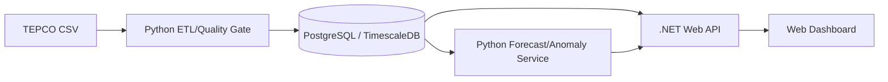

# Tokyo Grid EMS (AI Monitoring)  
An **EMS prototype** for TEPCO time-series: **demand forecasting / anomaly detection / monitoring dashboard**

[日本語](README.md) | English

---

## Overview
This project is an operations-oriented EMS (Energy Management System) prototype built on **TEPCO (Tokyo Electric Power Grid) public time-series data**.  
It forecasts grid demand and detects abnormal patterns early (spikes/drops and drift), aiming for an end-to-end pipeline:  
**ETL → quality gate → DB → forecasting/anomaly → API → dashboard/alerts**.

---

## Goals & Scope
- **Forecasting**: H+1 to H+24 / D+1 (start with hourly)
- **Anomaly detection**
  - **Spike/Drop** beyond forecast intervals (quantiles/CI)
  - **Drift** via residual EWMA/CUSUM (persistent deviation)
- **Reserve risk**: visualize risk zones using reserve margin / utilization
- **Data pipeline**: ingest → validate → store → feature/inference automation

---

## Data (TEPCO CSV)
- Source: TEPCO public demand/supply data
- Encoding: **Shift_JIS / cp932**
- Unit: **万kW (= 10MW)**
- Format: **multi-section CSV** (multiple tables concatenated with blank lines)
  - update timestamp (e.g., `2025/12/1 23:55 UPDATE`)
  - daily summary blocks (peak supply, forecast max, usage-peak blocks)
  - **hourly table (24 rows)**: `DATE,TIME,actual,forecast,utilization,supply`
  - **5-min table (288 rows)**: `actual(5-min), solar(5-min), solar ratio`

### Recommended handling
- Read with `cp932` / `shift_jis` (or convert to UTF-8)
- Normalize timestamps (`DATE + TIME`, Asia/Tokyo)
- Quality gate examples:
  - hourly=24 rows / 5min=288 rows
  - continuity (missing/duplicate/out-of-order)
  - outliers / suspicious zero-fill patterns

---

## Architecture (draft)


---

## Data Model (draft)
- `grid_hourly_load`: `ts, actual_mw, forecast_mw, usage_pct, supply_mw, source_date`
- `grid_5min_load`: `ts, actual_mw, solar_mw, solar_ratio_pct, source_date`
- `grid_daily_peak`: `target_date, kind, value_mw, time_band, info_updated_at`
- `grid_quality_events`: `source_date, severity, message, detected_at`

---

## Anomaly Strategy (ops-first)
1) **Spike/Drop**: alert when exceeding forecast intervals  
2) **Drift**: detect persistent deviation via residual EWMA/CUSUM  
3) **Reserve Risk**: thresholds on reserve margin/utilization with severity levels  

---

## Evaluation (recommended)
- Forecasting: MAE / RMSE / MAPE (Pinball Loss for quantiles)
- Alerts: precision/recall, detection delay, operator feedback loop

---

## Roadmap
0) Multi-section CSV parser  
1) ETL quality gate + TimescaleDB ingestion  
2) Baseline forecasting + backtesting  
3) Interval-based spike/drop + drift  
4) Reserve risk rules + dashboard  
5) Docker Compose → Azure (optional)  
6) Ops guide (retraining, tuning, incident handling)

---

## Quickstart (minimal)
```bash
# Python (ETL/ML)
pip install -r requirements.txt

# .NET API (optional)
dotnet run --project src/Api
```

---

## Author
Chang Wonhong  
LinkedIn: https://www.linkedin.com/in/wonhong-chang-6660a0177

---

## License / Notes
- See `LICENSE`.
- Follow the data provider’s terms for public datasets.
