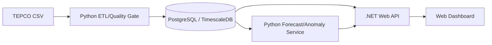

# Tokyo Grid EMS（AI Monitoring）  
TEPCO公開データを用いた **需要予測 / 異常検知 / 監視ダッシュボード** のEMS（Energy Management System）プロトタイプ

日本語 | [English](README.en.md)

---

## 概要
本プロジェクトは、**東京電力パワーグリッド（TEPCO）公開の時系列データ**を基に、電力需要を予測し、予測結果に対する**異常パターン（急騰/急落・ドリフト）**を早期検知する、運用志向のEMSプロトタイプです。  
単なる分析に留まらず、**ETL → 品質ゲート → DB → 予測/検知 → API → ダッシュボード/アラート**までを一気通貫で構築することを目標にしています。

---

## 目的（スコープ）
- **需要予測**：H+1〜H+24 / D+1 など（まずはHourly中心）
- **異常検知**：
  - 予測区間（信頼区間/分位）超過の **Spike/Drop**
  - 残差の移動平均/EWMA/CUSUM等による **Drift（持続的乖離）**
- **供給余力リスク**：予備率・使用率からリスク領域を可視化（ルールベース＋段階化）
- **データ基盤**：収集 → 整合性検証 → 蓄積 → 特徴量/推論の自動化

---

## データ（TEPCO CSV）
- 出所：東京電力パワーグリッド（電力需要・供給の公開データ）
- 文字コード：**Shift_JIS / cp932**（Excel互換）  
- 単位：**万kW（= 10MW）**
- フォーマット：単一テーブルではなく、**複数テーブルが空行で連結された“マルチセクションCSV”**
  - 更新時刻（例：`2025/12/1 23:55 UPDATE`）
  - 日次サマリ（ピーク時供給力、予想最大電力、使用率ピークなど）
  - **時間別（24行）**：`DATE,TIME,当日実績,予測値,使用率,供給力`
  - **5分間隔（288行）**：`当日実績(5分),太陽光実績(5分),太陽光割合`

### 取扱い（推奨）
- 読み込み：`cp932` / `shift_jis` で読み取り（またはUTF-8に変換）
- 正規化：`DATE + TIME` → timestamp（Asia/Tokyo想定）
- 品質ゲート（例）
  - hourly=24行 / 5min=288行
  - 時系列の連続性（欠損・重複・順序）
  - 異常値（負値・不自然な0埋めパターン）検知

---

## アーキテクチャ（案）


---

## データモデル（ドラフト）
- `grid_hourly_load`：`ts, actual_mw, forecast_mw, usage_pct, supply_mw, source_date`
- `grid_5min_load`：`ts, actual_mw, solar_mw, solar_ratio_pct, source_date`
- `grid_daily_peak`：`target_date, kind, value_mw, time_band, info_updated_at`
- `grid_quality_events`：`source_date, severity, message, detected_at`

---

## 異常検知の方針（運用優先）
1) **Load Spike/Drop**：予測値 ± 予測区間超過でアラート  
2) **Drift**：残差のEWMA/CUSUM等で“継続的乖離”を検知  
3) **Reserve Risk**：予備率/使用率の閾値でリスクを段階化し可視化  

---

## 評価（推奨）
- 予測：MAE / RMSE / MAPE（区間予測なら Pinball Loss 等）
- アラート：Precision/Recall、検知遅延、運用者フィードバックのループ

---

## ロードマップ
0. CSVフォーマット解析（マルチセクション）＋パーサ完成  
1. ETL品質ゲート＋TimescaleDB格納  
2. Baseline予測（Prophet等）＋バックテスト  
3. 予測区間ベースのSpike/Drop + Drift  
4. 供給余力リスク（予備率/使用率）＋ダッシュボード  
5. Docker Compose統合 → Azure（任意）  
6. 運用ガイド（再学習、アラート調整、障害対応）

---

## 実行（最小）
```bash
# Python (ETL/ML)
pip install -r requirements.txt

# .NET API（任意）
dotnet run --project src/Api
```

---

## リポジトリ内容（想定）
- `src/`：.NET API / UI（必要に応じて）
- `python/`：ETL/予測/異常検知
- `infra/`：docker-compose / DBスキーマ
- `docs/`：設計・メモ・スクリーンショット

---

## 著者
Chang Wonhong（Jerry）

---

## ライセンス / 注意
- ライセンスは `LICENSE` を参照してください。
- 公開データの利用条件は、提供元の規約に従ってください。
