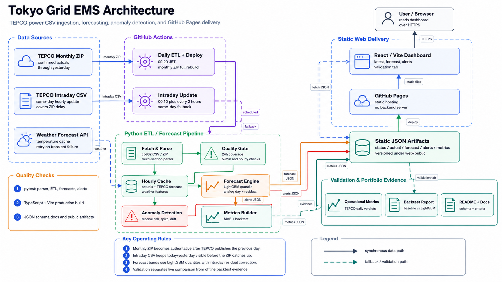

# Tokyo Grid EMS

**Power demand forecasting / anomaly detection / monitoring dashboard** built on TEPCO's public electricity data.

> [日本語](README_ja.md) · [한국어](README_ko.md)

- Live Dashboard: [https://wonhongchang.github.io/tokyo-grid-ems/](https://wonhongchang.github.io/tokyo-grid-ems/)

---

## Project Overview

An **automated static EMS (Energy Management System) prototype** built on time-series electricity data published by Tokyo Electric Power Company (TEPCO), providing core features:

- **Demand forecasting** (hourly, with peak time and value)
- **Anomaly detection** against forecasts (spikes/drops, residual drift, supply reserve risk)
- A **static dashboard** deployable to GitHub Pages at zero cost

> Assumption: the dashboard is served from static JSON on GitHub Pages, while same-day data is refreshed from TEPCO's intraday CSV every 2 hours.
> The UI centers on **yesterday's finalized anomaly report** + **today/tomorrow forecasts** + **same-day actual/TEPCO forecast comparison**.

---

## Tech Stack

| Role | Technology |
|------|------|
| ETL / Parsing | Python (pandas) |
| Forecasting / Anomaly Detection | Python (LightGBM + statistical fallback, rule-based anomaly detection) |
| Dashboard | React + Vite |
| Hosting | GitHub Pages (static JSON) |
| Automation | GitHub Actions (daily + every 2 hours) |

---

## Architecture



- **ETL**: Downloads TEPCO monthly ZIP daily → parses confirmed historical data → generates JSON → deploys to GitHub Pages
- **Intraday**: Fetches and updates today's TEPCO intraday CSV every 2 hours
- **Validation**: Generates model backtest and TEPCO-comparison metrics under `metrics/`

---

## Dashboard Layout

**Status bar (always visible)**
- Last updated time / data availability

**4 tabs**

1. **Yesterday** — Previous day's actuals + anomaly events
   - Spike / Drop: forecast interval (95/99%) breach
   - Drift: persistent residual bias (EWMA)
   - Reserve Risk: usage rate / reserve margin threshold breach

2. **Today** — Hourly forecast + forecast bands + peak prediction (time and value)

3. **Tomorrow** — Hourly forecast + forecast bands + peak prediction (time and value)

4. **Validation** — Model-vs-TEPCO forecast comparison + LightGBM backtest

---

## TEPCO Data Format

| Item | Details |
|------|------|
| Source | TEPCO public electricity supply/demand data |
| Encoding | **cp932 (Shift-JIS)** |
| Unit | **万kW (= 10 MW)** |
| Format | **Multi-section CSV** with multiple tables separated by blank lines |

---

## Repository Structure

```
.
├── python/
│   ├── tepc_parser.py          # TEPCO multi-section CSV parser
│   ├── etl/
│   │   ├── run_batch.py        # Batch runner (CSV → JSON)
│   │   ├── fetch_tepco.py      # TEPCO monthly ZIP downloader
│   │   ├── fetch_today.py      # Intraday real-time data fetcher
│   │   └── quality_gate.py     # Data quality checks
│   ├── forecast/               # Demand forecasting models
│   └── anomaly/                # Anomaly detection
├── web/                        # React/Vite dashboard
├── docs/
│   ├── en/                     # English documentation
│   ├── ko/                     # Korean documentation
│   ├── ja/                     # Japanese documentation
│   └── assets/                 # README and documentation images
└── data/
    └── raw/                    # Raw CSV data (auto-downloaded by Actions, git-ignored)
        └── YYYY/
            └── YYYYMM_power_usage/
```

---

## Quickstart

### Local setup

```bash
python -m venv .venv
# Windows: .venv\Scripts\activate
# macOS/Linux: source .venv/bin/activate
pip install -r requirements.txt

# Fetch TEPCO data
python python/etl/fetch_tepco.py

# Run ETL → generates JSON under web/public/
python python/etl/run_batch.py --input data/raw --out web/public

# Local dashboard preview
cd web && npm install && npm run dev
```

### GitHub Pages deployment

See [DEPLOY.md](DEPLOY.md).

---

## Static JSON Outputs

Files generated by the ETL under `web/public/`:

| File | Contents |
|------|------|
| `status.json` | Overall status (last updated, today/tomorrow forecast summaries) |
| `alerts/YYYY-MM-DD.json` | Anomaly detection event list |
| `forecast/YYYY-MM-DD.json` | Hourly forecast + prediction intervals (95/99%) |
| `actual/YYYY-MM-DD.json` | Hourly actuals (includes intraday real-time data) |
| `metrics/forecast_accuracy.json` | Operational accuracy against TEPCO forecasts |
| `metrics/model_backtest.json` | LightGBM backtest against the baseline |

> All timestamps are ISO 8601 in `Asia/Tokyo (+09:00)`.

---

## Documentation

- [Project walkthrough for students](docs/en/project-walkthrough.md)
- [LightGBM model design](docs/en/lgbm-design.md)
- [2026-05-13 daytime heat guard improvement](docs/en/model-improvements/model-improvement-2026-05-13-daytime-heat-guard.md)
- [2026-05-14 warm daytime bias guard](docs/en/model-improvements/model-improvement-2026-05-14-warm-daytime-bias-guard.md)
- [2026-05-14 lag temperature regime features](docs/en/model-improvements/model-improvement-2026-05-14-lag-temperature-regime-features.md)
- [2026-05-15 24h weather delta and apparent temperature features](docs/en/model-improvements/model-improvement-2026-05-15-24h-weather-apparent-features.md)
- [2026-05-16 business-type lag features](docs/en/model-improvements/model-improvement-2026-05-16-business-type-lag-features.md)
- [2026-05-17 intraday weather bias correction and forecast freezing](docs/en/model-improvements/model-improvement-2026-05-17-intraday-weather-bias-correction.md)
- [Weather integration design](docs/en/weather-integration.md)
- [Data retention and archive strategy](docs/en/data-retention-strategy.md)
- [Model evaluation report](docs/en/model-evaluation.md)
- [Anomaly detection criteria](docs/en/anomaly-criteria.md)
- [JSON schema contract](docs/en/json_schema.md)

---

## Roadmap

| Phase | Description | Status |
|---------|------|------|
| Phase 1–3 | ETL / Forecasting / Anomaly Detection / Dashboard | ✅ Done |
| Phase 4 | GitHub Pages auto-deploy | ✅ Done |
| Phase 5-A | LightGBM forecast model | ✅ In production |
| Phase 5-B | Weather data integration (Open-Meteo) | ✅ In production |
| Phase 6 | Validation tab / backtest / TEPCO comparison | ✅ Done |

---

## Author

- Chang Wonhong
- LinkedIn: https://www.linkedin.com/in/wonhong-chang-6660a0177/
