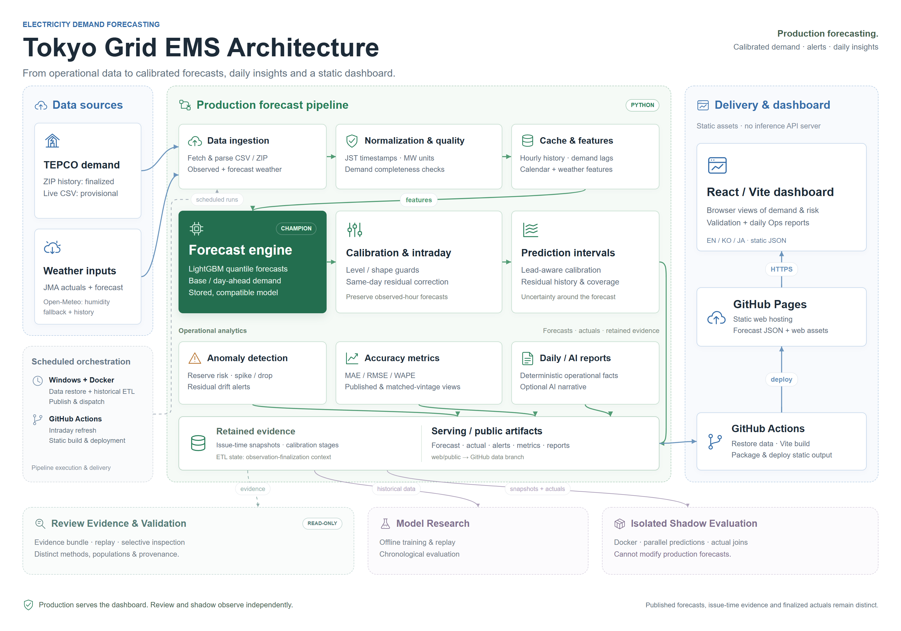

# Tokyo Grid EMS

TEPCO 공개 전력 데이터를 활용한 **전력 수요 예측 / 이상 탐지 / 모니터링 대시보드**

> [English](README.md) · [日本語](README_ja.md)

- 운영 대시보드: [https://wonhongchang.github.io/tokyo-grid-ems/](https://wonhongchang.github.io/tokyo-grid-ems/)

---

## 프로젝트 개요

도쿄전력 파워그리드(TEPCO)가 공개하는 시계열 전력 데이터를 기반으로, 아래 핵심 기능을 제공하는 **자동 갱신형 정적 EMS(에너지 관리) 프로토타입**입니다.

- 전력 수요 **예측** (시간별, 피크 시각/값 포함)
- 예측 대비 **이상 패턴 탐지** (급등/급락, 잔차 드리프트, 공급 예비율 위험)
- GitHub Pages로 공개 가능한 **정적 대시보드**

> 확정 이력은 로컬 Windows/Docker ETL이 갱신합니다. GitHub Actions는 오전·보충 실행을 포함한 예약 일정으로 당일 데이터를 갱신하고 정적 대시보드를 빌드·배포합니다.
> 따라서 **어제의 확정 이상 탐지 리포트** + **오늘/내일 예측 리포트** + **당일 실측/TEPCO 예측 비교**를 중심으로 화면을 구성합니다.

---

## 기술 스택

| 역할 | 기술 |
|------|------|
| ETL / 파싱 | Python (pandas) |
| 예측 / 이상 탐지 | Python (LightGBM + 통계 fallback, rule-based anomaly detection) |
| 대시보드 | React + Vite |
| 배포 | GitHub Pages (정적 JSON) |
| 자동 갱신 | 로컬 Windows/Docker ETL + GitHub Actions 예약 intraday 갱신 및 배포 |
| 운영 리포트 | Python 규칙 기반 fallback + 선택적 OpenAI 해설/번역 |

---

## 아키텍처



- **ETL**: 로컬 Windows 실행 제어가 Docker ETL을 구동하여 TEPCO 확정 이력과 피처를 갱신하고 정적 산출물을 data 브랜치에 게시합니다.
- **Intraday / 배포**: GitHub Actions 예약 실행이 당일 실측과 보정 예측을 갱신하며, 정적 빌드가 JSON과 React/Vite 대시보드를 GitHub Pages로 제공합니다.
- **리포트 / 검증**: 일일 지표와 선택적 AI 해설은 운영을 지원합니다. Review Evidence Bundle, replay, 격리된 shadow 평가는 production serving과 분리하여 근거를 분석합니다.

[아키텍처 설명과 편집용 소스](docs/architecture/tokyo-grid-ems-architecture.md)

---

## 대시보드 화면 구성

상태바는 갱신 시각과 데이터 취득 상황을 표시합니다.

| 탭 | 내용 |
|---|---|
| 어제 | 전날 실측과 급등·급락, 잔차 드리프트, 예비율 위험 이벤트 |
| 오늘 | 시간별 예측, 예측 구간, 실측, 피크 예상 |
| 내일 | 다음날 시간별 예측, 예측 구간, 피크 예상 |
| 검증 | 일일 지표, 모델·TEPCO 비교, LightGBM 백테스트 |
| 운영 리포트 | 근거 기반 일일 해설. 선택적 OpenAI 영어 분석·한일 현지화 또는 규칙 기반 fallback |

---

## TEPCO CSV 데이터 포맷

| 항목 | 내용 |
|------|------|
| 출처 | TEPCO 공개 전력 수요/공급 데이터 |
| 인코딩 | **cp932 (Shift-JIS)** |
| 단위 | **万kW (= 10 MW)** |
| 포맷 | 여러 테이블이 빈 줄로 연결된 **멀티 섹션 CSV** |

---

## 리포지토리 구조

```
.
├── python/
│   ├── tepc_parser.py          # TEPCO 멀티 섹션 CSV 파서
│   ├── etl/
│   │   ├── run_batch.py        # 배치 실행 (CSV → JSON 생성)
│   │   ├── fetch_tepco.py      # TEPCO 월별 ZIP 다운로드
│   │   ├── fetch_today.py      # 당일 실시간 데이터 취득
│   │   └── quality_gate.py     # 품질 검사
│   ├── forecast/              # 수요 모델, 보정, 예측 구간
│   ├── anomaly/               # 이상 탐지
│   └── eval/                  # 지표, 리포트, replay, Review Bundle, challenger 도구
├── scripts/                   # 로컬 실행 제어, 데이터 복원, 게시
├── docker/                    # 격리된 shadow 런타임 이미지
├── docker-compose.yml         # 로컬 ETL 및 독립 shadow 서비스
├── web/                        # React/Vite 대시보드
├── docs/
│   ├── en/                     # 영어 문서
│   ├── ko/                     # 한국어 문서
│   ├── ja/                     # 일본어 문서
│   └── assets/                 # README와 문서용 이미지
└── data/
    └── raw/                    # 원본 CSV (통상 로컬에서 취득, git 제외)
        └── YYYY/
            └── YYYYMM_power_usage/
```

---

## 빠른 시작

### 대시보드 미리보기

Git, Python 3, Node.js를 설치한 뒤 repository root에서 실행합니다.

```bash
python scripts/restore_public_from_data_branch.py
cd web
npm ci
npm run dev
```

복원 명령은 `web/public/`을 게시된 `origin/data` 내용으로 교체합니다. 미게시 로컬 산출물이 있다면 먼저 보존해야 합니다. 이 미리보기는 ETL이나 OpenAI 호출을 실행하지 않습니다.

### 운영 ETL 실행과 게시

Windows 호스트 스크립트에는 Docker Desktop, `py` launcher의 Python 3.14, Git 인증과 workflow dispatch 인증이 필요합니다. Repository root에서 실행합니다.

```powershell
# 최초 수동 실행: 확정 이력 ETL이 필요한 경우 이미지 빌드
powershell -NoProfile -ExecutionPolicy Bypass -File scripts\local_etl.ps1 -Build -Publish -AllowOffSchedule

# 이후 수동 실행
powershell -NoProfile -ExecutionPolicy Bypass -File scripts\local_etl.ps1 -Publish -AllowOffSchedule
```

호스트는 게시된 데이터·모델 상태를 복원하고, 전날 실측이 미확정이면 Docker ETL을 실행한 뒤 산출물 검증·게시와 배포/intraday dispatch를 수행합니다. 전날 실측이 이미 확정되었다면 이력 ETL은 건너뛰고 누락/fallback AI 리포트만 별도 복구할 수 있습니다. `-AllowOffSchedule`은 오전 예약 시간 밖의 수동 실행을 허용합니다. 게시에는 컨테이너가 아닌 호스트의 Git 인증을 사용합니다.

Python만으로 로컬 산출물을 다시 만들려면 `requirements.txt`를 설치한 뒤 `python python/etl/fetch_tepco.py`, `python python/etl/run_batch.py --input data/raw --out web/public`을 순서대로 실행합니다. 모델·상태 산출물을 복원하지 않은 새 환경에서는 배포된 Champion의 재현을 보장하지 않습니다.

### GitHub Pages 배포

[DEPLOY_ko.md](DEPLOY_ko.md)를 참고하세요.

---

## 정적 JSON 산출물

`data`에서 복원하거나 해당 파이프라인/도구가 생성하는 `web/public/`의 주요 산출물입니다.

| 파일 | 내용 |
|------|------|
| `status.json` | 전체 상태 (최종 업데이트, 오늘/내일 예측 요약) |
| `alerts/YYYY-MM-DD.json` | 이상 탐지 이벤트 목록 |
| `forecast/YYYY-MM-DD.json` | 시간별 예측값 + 예측 구간(95/99%) |
| `actual/YYYY-MM-DD.json` | 시간별 실적값 (당일 실시간 포함) |
| `metrics/forecast_accuracy.json` | TEPCO 최신 게시값 기준 운영 참고치. 공식 동일 vintage 비교에는 사용하지 않음 |
| `metrics/forecast_vintage_accuracy.json` | 동일 capture·lead-time으로 맞춘 모델/TEPCO 평가 |
| `reports/daily/*.json` | 검증 탭에 표시하는 전날 운영 리포트 |
| `reports/ai/daily/{ko,en,ja}/*.json` | 운영 리포트 탭의 일일 해설. OpenAI 설정 시 AI 해설, 미설정 시 deterministic fallback 사용 |
| `forecast_snapshots/`, `reports/internal/` | 검토용 예측 vintage, 보정 단계와 진단 근거. UI에서는 직접 링크하지 않음 |

백테스트·replay·승격 산출물은 [모델 운영 명세](docs/ko/model-operations-spec.md)에 정리되어 있습니다. 특히 `model_contract_comparison.json`은 명시적인 승격 도구가 작성하며 매 ETL에서 재생성하지 않습니다. `internal`이라는 이름은 접근 제어를 뜻하지 않으며 정적 배포에 포함될 수 있습니다.

> 타임스탬프는 전 산출물에서 `Asia/Tokyo (+09:00)` 기준 ISO 8601로 출력합니다.

### AI 운영 리포트 동작

- Intraday/status-only 실행은 AI 해설을 생성하지 않습니다. 일반 생성은 최신 확정 일일 리포트를 대상으로 하며, 기존의 성공한 OpenAI 리포트는 유지하고 누락/fallback 리포트는 별도 복구할 수 있습니다.
- 분석과 현지화 모델은 모두 `gpt-4o-mini`가 기본입니다. 기본 실행 예산은 **논리 호출 2회**이며 HTTP 시도 횟수나 비용의 하드 상한선은 아닙니다. 전송 재시도는 별도입니다.
- ETL에서 사용하려면 실행 전에 `TOKYO_GRID_EMS_OPENAI_API_KEY`와 `OPENAI_DAILY_REPORT_AUTO_ENABLE=true`를 설정합니다. 전용 리포트 CLI는 대신 `--use-openai`를 받습니다. `.env`나 키는 커밋하지 않으며 프로젝트 리포트에 일반 런타임 변수 `OPENAI_API_KEY`를 사용하지 않습니다.
- 분석을 생성할 수 없으면 규칙 기반 fallback을 사용하고, 현지화 실패 시 `localizationStatus: "fallback_en"`으로 영어 마스터를 유지합니다. AI 추천은 예측에 자동 적용되지 않습니다.

활성화 예시, 재시도 예산, timeout과 리포트 전용 복구는 [운영 리포트 설정과 비용 제어](docs/ko/ops-report-tab.md)를 참고하세요.

---

## 문서

- [처음 접하는 사람을 위한 프로젝트 가이드](docs/ko/project-walkthrough.md)
- [LightGBM 모델 설계](docs/ko/lgbm-design.md)
- [모델 운영 명세](docs/ko/model-operations-spec.md)
- [모델 승격 및 성능 저하 Champion 정책](docs/ko/model-promotion-policy.md)
- [운영 Runbook](docs/ko/operations-runbook.md)
- [모델 점검 기록](docs/ko/model-reviews/README.md)
- 모델 점검 도구: [근거 패키지와 읽기 전용 CLI](docs/ko/review-bundle-cli.md), [검증 요약](docs/ko/review-bundle-validation.md)
- 실험용 [학습형 intraday challenger와 격리된 shadow 평가](docs/ko/learned-intraday-challenger.md)
- 독립 [Docker multi-challenger shadow 서비스](docs/ko/docker-intraday-shadow.md)
- [기온 데이터 연동 설계](docs/ko/weather-integration.md)
- [데이터 보존 및 아카이브 전략](docs/ko/data-retention-strategy.md)
- [모델 평가 리포트](docs/ko/model-evaluation.md)
- [이상탐지 기준](docs/ko/anomaly-criteria.md)
- [운영 리포트 탭 설명](docs/ko/ops-report-tab.md)
- [AI 운영 리포트 가드레일](docs/ko/ai-report-guardrails.md)
- [JSON 스키마 계약](docs/ko/json_schema.md)

---

## 모델 개선 이력

선별된 최근 운영 개선:

- [2026-09-21 실측 회복을 고려한 주말 저녁 잔차 감쇠](docs/ko/model-improvements/model-improvement-2026-09-21-observed-evening-recovery.md)
- [2026-09-13 관측 근거 기반 주말 아침 shape floor·AI 리포트 근거 수정](docs/ko/model-improvements/model-improvement-2026-09-13-observed-weekend-shape-support.md)
- [2026-09-11 모델 점검·연속 하락 복원 완화·replay origin 수정](docs/ko/model-improvements/model-improvement-2026-09-11-review-and-sustained-decline.md)

전체 날짜순 로그: [docs/ko/model-improvements/README.md](docs/ko/model-improvements/README.md)

---

## 로드맵

| 페이즈 | 내용 | 상태 |
|---------|------|------|
| Phase 1–3 | ETL / 예측 / 이상 탐지 / 대시보드 | ✅ 완료 |
| Phase 4 | GitHub Pages 자동 배포 | ✅ 완료 |
| Phase 5-A | LightGBM 예측 모델 | ✅ 운영 반영 |
| Phase 5-B | JMA 실측·예보 + Open-Meteo 습도·이력 보조 | ✅ 운영 반영 |
| Phase 6 | 검증 탭 / 백테스트 / TEPCO 비교 | ✅ 완료 |

---

## 작성자

- Chang Wonhong
- LinkedIn: https://www.linkedin.com/in/wonhong-chang-6660a0177/

---

## 라이선스

이 프로젝트는 [MIT License](LICENSE)를 따릅니다.
