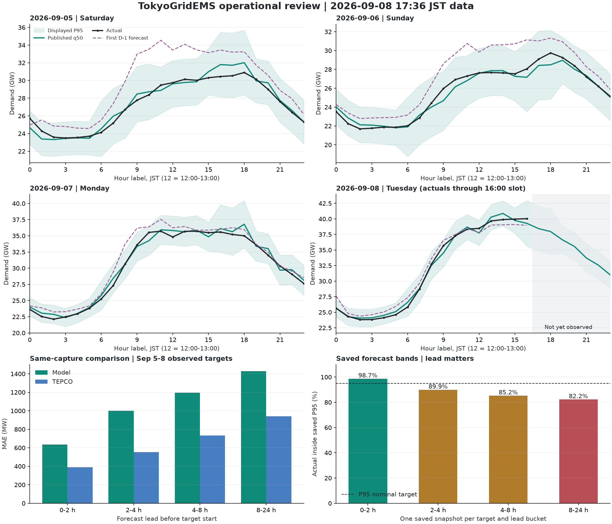

# 2026-09-08 Operational Forecast Review

Follow-up: [September 9 serving calibration contracts](../model-improvements/model-improvement-2026-09-09-serving-calibration-contracts.md) implements the three P0 corrections with tests. P1 weather sensitivity, conditional guard ablation and health integration remain open. The measurements below describe the September 8 publication, not the revised policy's performance.

Languages: [한국어](../../ko/model-reviews/model-review-2026-09-08.md) / [日本語](../../ja/model-reviews/model-review-2026-09-08.md)

Evidence cutoff: GitHub Pages publication at 2026-09-08 17:36:25 JST, `origin/data` commit `0e9a67dcb`. The live status, today's actual/forecast, and yesterday's forecast JSON matched this commit.

Evening supplement: **Section 2.1** separately evaluates observations through slot 20 from the 21:40:32 JST publication (`37d845332`). Original tables and the chart retain the 17:36 cutoff rather than mixing evaluation vintages.

Model: `v14-r2-source-robust-day-ahead`, artifact `c2914b699dc306c61c6eb8f777d99fdebf1f7336dbf83bd01d851156e8b0cdd3`. The trained artifact is unchanged after the September 4 source changes.

Decision: **Recent displayed errors are smaller, but advance forecasts and longer-lead intervals still need work. The review assessment is `review_required`.** This review changes documentation only, not the model, configuration, or deployed data.

## 1. Evidence and Evaluation

- Finalized actuals run through September 7. Today's provisional observations cover 17 slots, 00 through 16. Slot 16 means 16:00-17:00. Slots 17-23 remain unscored.
- September 4 is a serving-policy transition day. The main post-change window is September 5-7, 72 hours, or 89 hours including today. The preceding window is August 22-September 3, 312 hours.
- `tepco_forecast_fallback` values are excluded as actuals. Each finalized evaluation day has 24 observed slots.
- The final published line is an operational outcome. An in-progress slot can still be revised before its actual arrives, so it is evaluated separately from predictions issued before the slot starts.
- TEPCO comparisons use forecasts captured together. Within each date, target hour, and lead bucket, only the minimum positive lead is selected. Frequent/manual runs do not receive extra weight. Equal capture times do not establish equal source issuance times.
- Interval evaluation uses boundaries saved in the issuance snapshot. The 16-per-day forecast snapshot limit leaves fewer rows than the TEPCO vintage ledger; the two tables are not identical row cohorts.
- The post-change period is short. These results support diagnosis and experiment design, not long-term calibration guarantees.

## 2. Published-Line Performance

| Date | Regime | Hours | MAE MW | WAPE | Bias MW | Max Absolute Error MW |
|---|---|---:|---:|---:|---:|---:|
| 09-04 | Transition day | 24 | 656.5 | 2.06% | -97.6 | 1,560.0 |
| 09-05 | Saturday | 24 | 488.9 | 1.79% | +146.9 | 1,344.2 |
| 09-06 | Sunday | 24 | 409.8 | 1.60% | -173.7 | 1,289.7 |
| 09-07 | Monday | 24 | 543.8 | 1.80% | +271.4 | 1,790.8 |
| 09-08 | Tuesday, provisional | 17 | 440.9 | 1.38% | +66.5 | 1,185.7 |

September 5-7 MAE is 480.8MW; including today it is 473.2MW, versus 706.3MW for the preceding 13 days. Weather, demand levels, and the sample composition changed, while the q50 artifact did not. This is not evidence of a causal q50 improvement from the September 4 patch.

Including today, time-band MAEs are 332.7MW overnight, 538.7MW at 06-10, 406.9MW at 11-15, **995.3MW at 16-18**, and 350.8MW at 19-23. Late afternoon remains weak. Today's evening is not included.

### 2.1. Evening Supplement: Today's Slots 00-20

The 21:40:32 JST Pages status/actual/forecast matched `37d845332`. Published predictions for slots 00-16 are unchanged from the initial review. Slots 21-23 remain unscored.

Across today's 21 observed slots, **MAE is 462.7MW, WAPE is 1.40%, and bias is -51.9MW**. The largest absolute error remains 1,185.7MW at 09:00.

| Slot | Actual MW | Final Published Forecast MW | Error MW | Error of the 17:36 Forecast MW |
|---|---:|---:|---:|---:|
| 17 | 39,190.0 | 38,430.0 | -760.0 | -760.0 |
| 18 | 38,690.0 | 37,963.1 | -726.9 | -726.9 |
| 19 | 37,320.0 | 36,914.5 | -405.5 | -693.6 |
| 20 | 35,610.0 | 35,281.4 | -328.6 | -31.9 |

In the 17:36 run, the raw 18:00 forecast was 38,379.7MW, already 310.3MW below the actual. A -447.7MW residual adjustment to pre-calibration 38,410.8MW produced 37,963.1MW. Unlike Monday's raw overprediction at 18:00, today's correction pushed an already low raw forecast further down. The update improved slot 19 but worsened slot 20. Target-specific correction needs testing; a blanket increase in downward control is not supported.

Updated same-capture, pre-target comparison for today gives model/TEPCO MAE of **558.3/330.0MW** at 0-2 hours (20 samples) and **947.7/450.0MW** at 2-4 hours (18 samples). Recovery of the final published line coexists with weaker advance forecasts. Multi-day aggregates in Sections 3-6 retain the original evidence cutoff.

## 3. Forecasts Issued Before the Target

Same-capture comparison for September 5-8 observed targets:

| Lead | Target Samples | Model MAE MW | TEPCO MAE MW | Ratio |
|---|---:|---:|---:|---:|
| 0-2 hours | 85 | 635.5 | 389.1 | 1.63 |
| 2-4 hours | 77 | 998.9 | 553.3 | 1.81 |
| 4-8 hours | 69 | 1,197.1 | 732.3 | 1.63 |
| 8-24 hours | 53 | 1,429.6 | 940.8 | 1.52 |

Today alone, 0-2-hour MAE is 525.5MW versus TEPCO's 332.5MW; 2-4-hour MAE is 1,064.3MW versus 451.4MW. A reasonable final chart does not eliminate the upward bias in earlier forecasts. This comparison does not use TEPCO's later revisions of past predictions.

The new first D-1 origins were captured near midnight of the preceding day, giving roughly 24-48-hour target leads. Their daily MAEs are 2,392.3MW Saturday, 1,804.5MW Sunday, 964.8MW Monday, and 860.6MW for today's observed portion. The weekend was especially overestimated a day earlier and recovered through same-day updates. That recovery combines weather/demand input updates and multiple controls, not only residual correction.

## 4. Specific Failure Mechanisms

### Today's 09:00: raw changes with weather inputs

At 08:31, the 09:00 raw forecast was 36,557.3MW and the corrected value was 36,187.5MW. At 09:32, raw fell **1,736.2MW** to 34,821.1MW; 34,504.3MW was published. Actual demand was 35,690MW, leaving -1,185.7MW error.

`temp_delta_24h` changed from +2.1 to +1.1°C and humidity from 99 to 93%. Residual adjustment weakened from -401.0 to -347.9MW. The main movement therefore occurred in raw prediction, not stronger downward residual propagation. Weather changed at the same time, but temperature alone is not established as the cause. Full input and issuance provenance are needed for isolated replay.

### Lunch: business-day status alone is insufficient

| Date | Published 11-to-12 Change | Actual Change |
|---|---:|---:|
| Saturday 09-05 | +744.8MW | +270MW |
| Sunday 09-06 | +779.1MW | +330MW |
| Monday 09-07 | -105.1MW | -890MW |
| Tuesday 09-08 | -949.2MW | +130MW |

There is no evidence of a forced weekday lunch dip on the weekend. Monday's true dip was understated; today's forecast dipped although actual demand rose. Increasing every weekday noon dip would worsen days like today.

Today's noon raw forecast fell from 39,815.1MW at 10:38 to 37,268.8MW at 11:36. At the 12:25 run that produced the retained value, raw recovered to 38,886.4MW. Pre-calibration 38,917.6MW then received -183.4MW residual adjustment and **-1,000MW `morning_observed_anchor_cap`**, ending at 37,734.2MW against actual 38,480MW. The Midday Guard contributed no additional reduction in that run.

Removing only this cap from that run gives 38,734.2MW and +254.2MW error. This is a local arithmetic counterfactual, not a full replay with the guard disabled. The cap referenced the run's recalculated historical pre-forecast residual, not the previous published error. Its context must be checked against the current target's actual excess.

### Monday 10:00: correction amplified an already small raw error

At 09:31, raw 35,313.8MW was only 216.2MW below actual 35,530MW. Pre 35,363.4MW received -496.7MW residual adjustment and -612.5MW warm-lag guard, producing 34,254.2MW. The final published value was also low at 34,242.5MW. This is evidence of excessive downward control, not proof that the business-return regime was unrecognized.

### Late afternoon: errors have both signs

Saturday's 16-18 errors were +1,344.2 / +1,188.8 / +1,111.9MW. Sunday's 18:00 error was -1,258.2MW and Monday's was +1,790.8MW.

For Monday 18:00, the 17:40 run produced raw 37,038.7 -> pre 37,088.3 -> final 36,790.8MW against actual 35,000MW. Correction removed about 297.5MW but could not resolve the raw overestimate. The forecast was already high before 18:00; Freeze did not cause it.

Today's 14:00 raw 42,838.9MW was reduced to 40,880MW, still 990MW high. At 16:00 the model was 738.7MW low. The remaining 17-23 line declines, but its accuracy cannot yet be scored.

## 5. Intervals: Narrower, but Not Qualified Across Leads

Final published P95 half-width fell 32.2%, from 3,700.8MW in the previous 13 days to 2,507.8MW in the latest three finalized days. Final-line coverage is 100%. Issuance snapshots reveal a different picture:

| Lead | Target Samples | Saved P95 Coverage | Mean Half-width MW |
|---|---:|---:|---:|
| 0-2 hours | 77 | 98.70% | 2,509.4 |
| 2-4 hours | 69 | 89.86% | 2,608.8 |
| 4-8 hours | 61 | 85.25% | 2,634.6 |
| 8-24 hours | 45 | 82.22% | 2,718.0 |

Excluding incomplete today, the three finalized days have 87.04 / 81.25 / 77.78% coverage for 2-4 / 4-8 / 8-24 hours. Final published residuals do not adequately represent longer-lead uncertainty.

The target policy groups `finalized_actual_vs_served_forecast` residuals by time band and business regime, without lead or artifact separation, then replaces native intervals for both today and tomorrow. JSON normalization also follows q50 Freeze, so an updated profile can recalculate intervals on already-observed slots. Final JSON interval coverage is not issuance-time interval coverage.

**Correction to the September 4 document:** its 12-day band experiment used final published forecasts retrospectively. Calling it a "fixed-origin" band holdout was incorrect. The numbers do not prove independent, lead-specific holdout performance. All three language versions have been corrected. The q50 candidate fixed-origin experiments were a separate evaluation.

Today's P95 half-width jumps **1,632.8MW**, from 2,021.2 to 3,654.0MW, between 15:00 and 16:00 because the time-band group changes. Lead-specific calibration should be validated before cosmetic smoothing. The P99 rule of twice the P95 half-width is not an independently validated 99% guarantee either.

## 6. Additional Operational Findings

### Fresh state does not imply fresh matching-regime evidence

Monday's calibration used `historyDates = [08-19, 08-20, 08-28]` while reporting `stateStatus=fresh`. Sunday's entry refreshed the global state date. The code checks the latest date across all entries before selecting the matching regime.

Today morning it selected `[08-20, 08-28, 09-07]`. The latest entry alone does not make all three samples recent or comparable in issuance lead. Near-D0 seeds and new D-1 origins also require an explicit compatibility check. Freshness should be measured against the expected latest finalized matching-regime evidence, with an issuance contract for the cohort.

On 76 deduplicated 0-2-hour stage rows across September 5-8, raw MAE was 727.4MW, after same-regime calibration 835.4MW, before Intraday 830.9MW, and final 648.1MW. This supports testing stale/long-lead level corrections separately, not disabling all calibration. Residuals must be recomputed in a real ablation.

### Terminal shape/ramp changes are absent from residual component totals

At 13:32 today, the 14:00 row has `pre=42,870.1`, logged `finalAdjustmentMw=-112.1`, and actual post `40,880.0`. The extra **-1,878.0MW** occurs after residual logging in the terminal guards. Seven snapshot rows have this mismatch in September 5-8.

The code builds residual logs before `_apply_shape_guard` and `_apply_ramp_guard`. `calibrationDeltaMw` contains the total change, but the component sum does not explain it. AI reports can misattribute the change to residual propagation. Log and validate `pre + residual + shape_delta + ramp_delta = post`, with Freeze recorded separately.

### Health has a limited meaning

`championHealth=healthy` means the current artifact checks and final-line MAE/WAPE thresholds passed. It does not currently account for longer-lead interval undercoverage or matching-cohort freshness. It is not a qualification of TEPCO-level advance accuracy.

## 7. Pipeline Checks

- All eight inspected recent Intraday runs succeeded. Pages matches the data branch, and morning ETL finalized September 7.
- First D-1 origins for September 5-9 are retained separately from the bounded rolling snapshots.
- September 5-7 AI reports show `provider=openai`, `model=gpt-4o-mini`, `localizationStatus=ok`. This review made no additional API calls. Successful generation and narrative quality are separate questions.
- Weather values exist in diagnostics, but complete issue-time and source lineage remains incomplete. These findings do not establish an error in JMA itself.

## 8. Next Changes

| Priority | Change | Acceptance Evidence |
|---|---|---|
| P0 | Calibrate intervals by lead, artifact, and serving policy | Use historical issuance snapshots; back off to validated parent/native conservative intervals with insufficient samples. Do not narrow long leads using final-line residuals |
| P0 | Matching-cohort freshness and origin compatibility | An entry from another regime cannot make an old cohort fresh. Explicitly handle mixed D0/D-1 evidence |
| P0 | Record terminal shape/ramp deltas | Component totals reconcile with post within rounding tolerance; expose separate controls to AI reports |
| P1 | Conditional ablation of warm/anchor caps | Reduce September 7 10:00 and September 8 noon underprediction without restoring large errors on truly overheated days; separate pre-September-4 development from later evaluation |
| P1 | Raw weather-update sensitivity and lead-level bias | Reproduce September 8 09/12/14 and September 7 18 with input vintages; evaluate D-1 and 0-2/2-4-hour performance |
| P1 | Connect interval provenance to health | Do not replace issuance-time evidence with recomputed bands; include lead-specific undercoverage |

Today's evidence does not justify a blanket downward q50 change or removing all guards. Confirmed correctness gaps can be addressed before the next calendar review. Raw-model candidates should use the planned fixed observation-window review after September 11 morning ETL; four days do not establish all-season improvement.
