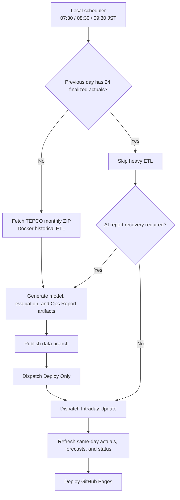

# Operations Runbook

**English** | [한국어](../ko/operations-runbook.md) | [日本語](../ja/operations-runbook.md)

This runbook defines the standard procedures for operating TokyoGridEMS and recovering from failures. See the [Model Operations Specification](model-operations-spec.md) for model internals and feature details.

## 1. Operating Principles

- All dates and operational decisions use JST (UTC+9).
- Finalized previous-day actuals and same-day intraday data are handled by separate ingestion paths.
- The TEPCO forecast is an external reference, not a model input or calibration target. A source-labelled fallback may be used only as a temporary lag input when the 23:00 actual is not yet published.
- Do not change model or guard thresholds from a single bad day unless the cause is a confirmed data or code defect. Compare multiple days in the same regime and the operational replay.
- A challenger never overwrites the champion automatically. It must pass temporal validation, absolute quality limits, segment regression checks, and prediction-drift gates.
- Failure of the OpenAI narrative must not block publication of finalized actual and forecast JSON. A fallback report is a degraded continuity state and should be regenerated separately.

## 2. Operating Flow

Scheduled historical ETL runs locally in Docker because GitHub-hosted runners may receive HTTP 403 from the TEPCO monthly ZIP endpoint. The `Manual ETL + Deploy` workflow has no schedule and is reserved for emergency manual execution.

## 3. Daily Operations

### 3.1 Morning Finalization ETL

The local scheduler runs at 07:30, 08:30, and 09:30 JST.

1. Restore the latest public state from `origin/data` into `web/public`.
2. Check whether the previous-day actual JSON has 24 non-fallback observed hours.
3. If incomplete, refetch the TEPCO monthly ZIP and run historical ETL.
4. Generate the previous-day Ops Report and publish the `data` branch.
5. Dispatch `Deploy Only`, then `Intraday Update`, so the same-day chart is refreshed as well.

Once the first run finalizes the previous day, later runs skip heavy ETL. They retry only a degraded report when necessary; otherwise they dispatch intraday refresh only.

### 3.2 Same-Day Intraday Updates

The scheduled intraday runs serve these purposes:

- 00:10 JST: dashboard date rollover
- 01:20, 03:20, 05:20 JST: overnight refreshes
- 06:20 JST plus local ETL at 07:30, 08:30, 09:30 JST: morning-ramp coverage
- 10:20 through 21:20 JST: approximately two-hour refreshes
- 12:05 JST: catch-up for a delayed or missed 11:20 run
- 23:50 JST: late retry for the 22:00 actual

GitHub scheduled runs can be delayed or skipped. Do not classify one missed run as a model incident. Check the next run, workflow status, and public JSON `generatedAt` together.

### 3.3 End-of-Day Checks

- Confirm that the latest observed hour in today's actual data is plausible.
- Fallback values must remain distinguishable from actual observations through `actualSource`.
- A missing 23:00 actual must not stop the pipeline, but the next historical ETL must replace it with finalized data.
- Preserve `forecast_snapshots` and operational calibration snapshots when an unusual served curve appears.

## 4. Daily Artifacts

| Artifact | What to inspect | Healthy state |
|---|---|---|
| `status.json` | Public data coverage and generation state | `availability: ok`, current date range |
| `actual/YYYY-MM-DD.json` | Finalized previous-day actuals | 24 non-fallback hours |
| `forecast/YYYY-MM-DD.json` | Today and tomorrow forecasts | 24 hours each |
| `reports/ai/daily/YYYY-MM-DD.json` | Previous-day narrative | `provider: openai` preferred; regenerate on failure |
| `ops/local_etl_status.json` | Latest local batch state | publish, deploy, and intraday stages recorded |
| `metrics/model_promotion.json` | Champion/challenger outcome | Interpret using the status table below |
| `metrics/model_shadow_evaluation.json` | Recovery-candidate live evidence | `passed: true`, at least 72 hours and two finalized days before approval |
| `metrics/operational_replay.json` | Recent served performance | Period, segment error, and interval coverage reviewed |
| `metrics/forecast_vintage_accuracy.json` | Fair TEPCO benchmark | `collecting` until complete 28/84-day windows; never treat collecting as a pass |

## 5. Weekly Model Operations

By default, challenger evaluation runs during Monday ETL. `validation_window_days: 28` means every evaluation uses the latest 28 finalized days as a rolling window; it does not mean the model is replaced once every 28 days.

Degraded-Champion recovery criteria are defined in the [Model Promotion and Degraded Champion Policy](model-promotion-policy.md). Recovery is fail-closed: a candidate must pass temporal recovery gates, auxiliary windows, drift, shadow evidence, and explicit approval.

### 5.1 Promotion Status

| `status` | Meaning | Operator action |
|---|---|---|
| `promoted` | All validation and drift gates passed | Inspect the new champion curve and metadata |
| `recovery_promoted` | Approved degraded-Champion recovery completed | Verify rollback artifact and stabilization metrics immediately |
| `recovery_candidate_ready` | Replay and required shadow evidence passed; manual approval remains | Keep serving Champion until the operator explicitly approves recovery |
| `recovery_approval_rejected` | Approval was requested for missing, stale, or insufficient shadow evidence | Champion remains active; repair the evidence contract and never bypass it |
| `shadow_required` | Drift is high or recovery shadow evidence is missing/incomplete | Do not promote; inspect the preserved shadow artifact and evidence failures |
| `rejected` | A quality or drift gate failed | Keep the champion and record failed gates as experiment evidence |
| `champion_retained` | Retraining is not due | Normal state; do not force retraining |
| `gate_error` | Evaluation execution failed | Confirm champion continuity, then repair logs or input data |

### 5.2 Promotion Evidence

The current gate combines:

- temporal validation over the latest 28 finalized days;
- MAE improvement over the baseline;
- absolute limits for MAE, WAPE, shape-delta MAE, and maximum error;
- segment regressions across time bands and business-day types;
- mean and maximum today/tomorrow prediction drift versus the champion.

TEPCO is not a training or calibration target. `forecast_accuracy.json` is a latest-value reference; only the complete same-capture `forecast_vintage_accuracy.json` can support parity qualification.

### 5.3 Forced Retraining

Use `TOKYO_GRID_EMS_FORCE_MODEL_TRAIN=1` only when:

- training features or model structure changed;
- the champion artifact is missing or corrupted; or
- the promotion path is being tested in a controlled experiment.

Do not force retraining merely because today's error is large.

## 6. Reading Operational Replay

`metrics/operational_replay.json` evaluates the forecasts that were actually served over recent finalized days.

- `served`: model MAE, WAPE, RMSE, and shape error
- `reference.tepco`: TEPCO values over matching hours
- `interval`: interval coverage and width
- `stages`: raw and post-processing performance for dates with snapshots
- `analogShadow`: shadow performance with Analogous Day adjustment
- `coverage`: evaluated hours and missing stage-snapshot dates

`missingStageSnapshotDates` does not mean daily actual coverage is incomplete. It means stage-level attribution is unavailable for those dates.

## 7. Change Policy

| Situation | Fix immediately | Observe first |
|---|---|---|
| Missing JSON, incorrect actual source, date-boundary defect | Yes | |
| Deployment, scheduling, or authentication failure | Yes | |
| Reproducible abnormal spike with confirmed code cause | Yes, with regression test | |
| One-day MAE regression or loss to TEPCO | | Review at least three comparable days and replay |
| New feature, guard, or threshold proposal | | Require temporal backtest and segment regression checks |
| One interval miss or unusual width | | Evaluate coverage and width over multiple finalized days |

Every model change should record its hypothesis, falsification condition, affected segment, and rollback criterion. Fitting an already-observed hour after the fact is not a forecast improvement.

## 8. Incident Response

| Symptom | Inspect first | Action |
|---|---|---|
| TEPCO historical fetch returns 403 | Local fetch log and URL access | Rerun local Docker ETL instead of proxying the hosted runner |
| Previous-day actuals remain incomplete | `.etl_state.json` and actual sources | Retry during the morning window; never mark them final manually |
| Intraday workflow fails | Actions status and data push conflict | Wait for the next run during a GitHub incident; dispatch manually if persistent |
| AI report fails | Provider, HTTP status, project-specific key | Publish forecast data first and regenerate only the report |
| Promotion reports `gate_error` | Training volume, config, artifact compatibility | Confirm champion continuity before repairing the cause |
| Pages serves stale data | Latest `data` commit and Deploy Only | Redeploy after successful data publication |
| Interval is too narrow or wide | Coverage and tail diagnostics | Evaluate calibration shadow instead of reshaping one day |

## 9. Recovery and Rollback

1. Separate collection, training, post-processing, and deployment failures.
2. Compare the latest healthy `data` commit with the current state.
3. For a model incident, restore `.lgbm_model.pkl` and `.lgbm_model_meta.json` from the last healthy Git revision.
4. Do not hand-edit public JSON; rerun ETL from the same inputs.
5. Republish only after promotion and public-artifact validation pass.
6. Document the root cause and add a regression test.

## 10. Public and Private Information

This runbook, promotion policy, schedule, and incident principles are public for reproducibility and operational trust.

Never commit:

- API keys, GitHub tokens, or credentials;
- personal usernames and absolute workstation paths;
- Windows scheduled-task accounts;
- local `.env` contents or authentication logs.

Machine-specific registration commands and log locations belong in a separate private local-operations note.
