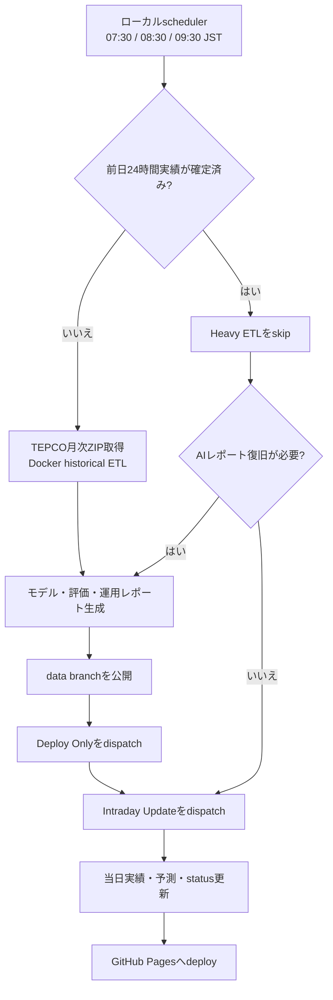

# 運用 Runbook

[English](../en/operations-runbook.md) | [한국어](../ko/operations-runbook.md) | **日本語**

本書はTokyoGridEMSを安定運用し、障害から復旧するための標準手順を定義します。モデル内部と特徴量の詳細は[モデル運用仕様](model-operations-spec.md)を参照してください。

## 1. 運用原則

- すべての日付と運用判断はJST（UTC+9）を基準とします。
- 前日確定実績と当日intradayデータは、別の収集経路で管理します。
- TEPCO予測は外部比較値であり、モデル入力や補正目標には使用しません。ただし23時実績が未公開の場合に限り、出所を明示したfallbackを一時的なlag入力として使用できます。
- データやコードの欠陥が確定していない限り、1日の誤差だけでモデルやguardの閾値を変更しません。同じregimeの複数日とoperational replayを確認します。
- ChallengerはChampionを無条件に上書きしません。時系列検証、絶対品質上限、segment退行、予測driftの全gateを通過する必要があります。
- OpenAI運用レポートの失敗で、確定実績と予測JSONの公開を止めません。fallbackは継続提供のための劣化状態として扱い、レポートのみ再生成します。

## 2. 運用フロー

GitHub-hosted runnerではTEPCO月次ZIPがHTTP 403になる場合があるため、定期historical ETLはローカルDocker batchが担当します。`Manual ETL + Deploy`にscheduleはなく、緊急時の手動実行専用です。

## 3. 日次運用

### 3.1 朝の確定ETL

ローカルschedulerは07:30、08:30、09:30 JSTに実行されます。

1. `origin/data`の最新公開状態を`web/public`へ復元します。
2. 前日actual JSONにfallbackではない24時間の観測値があるか確認します。
3. 未確定ならTEPCO月次ZIPを再取得し、historical ETLを実行します。
4. 前日の運用レポートを生成し、`data` branchへ公開します。
5. `Deploy Only`の後に`Intraday Update`を呼び、当日chartも更新します。

最初の実行で前日が確定すれば、後続実行はheavy ETLをskipします。レポートだけが劣化状態ならレポートを再試行し、正常ならintraday更新だけを呼びます。

### 3.2 当日Intraday更新

定期Intraday scheduleの目的は次のとおりです。

- 00:10 JST: dashboardの日付切替
- 01:20、03:20、05:20 JST: 深夜更新
- 06:20 JSTとローカルETL 07:30、08:30、09:30 JST: 朝rampの補強
- 10:20から21:20 JST: おおむね2時間ごとの更新
- 12:05 JST: 11:20実行の遅延・欠落補完
- 23:50 JST: 22時実績の遅延再取得

GitHubのscheduleは遅延・欠落する場合があります。1回の欠落だけでモデル障害と判断せず、次の実行、workflow状態、公開JSONの`generatedAt`を合わせて確認します。

### 3.3 日末確認

- 当日actualの最新観測時刻が妥当か確認します。
- fallbackは`actualSource`で実測と区別されている必要があります。
- 23時実績がなくてもpipelineを停止しませんが、翌朝のhistorical ETLで確定実績に置換される必要があります。
- 異常なserved curveが出た場合は`forecast_snapshots`とoperational calibration snapshotを保存します。

## 4. 日次確認artifact

| Artifact | 確認内容 | 正常基準 |
|---|---|---|
| `status.json` | 公開データ範囲と生成状態 | `availability: ok`、最新の日付範囲 |
| `actual/YYYY-MM-DD.json` | 前日確定実績 | fallbackを除く24時間 |
| `forecast/YYYY-MM-DD.json` | 今日・明日予測 | 各24時間 |
| `reports/ai/daily/YYYY-MM-DD.json` | 前日運用解説 | `provider: openai`を推奨、失敗時は再生成 |
| `ops/local_etl_status.json` | 最新local batch状態 | publish、deploy、intraday段階を確認 |
| `metrics/model_promotion.json` | Champion/Challenger結果 | 下表のstatusで判断 |
| `metrics/operational_replay.json` | 最近のserved性能 | 期間、segment誤差、interval coverage |

## 5. 週次モデル運用

既定では月曜日ETLでChallenger評価を行います。`validation_window_days: 28`は28日ごとの交換ではなく、各評価で直近の確定28日を使うrolling windowです。

### 5.1 Promotion status

| `status` | 意味 | 運用対応 |
|---|---|---|
| `promoted` | 全validation・drift gate通過 | 新Championのcurveとmetadataを確認 |
| `rejected` | 品質またはdrift gate失敗 | Championを維持し、失敗項目を実験候補として記録 |
| `champion_retained` | 再学習予定日ではない | 正常。強制再学習しない |
| `gate_error` | 評価実行自体が失敗 | Champion継続を確認後、logと入力を復旧 |

### 5.2 Promotionの証拠

現在のgateは次を組み合わせます。

- 直近28確定日の時系列validation
- baselineに対するMAE改善
- MAE、WAPE、shape delta MAE、最大誤差の絶対上限
- 時間帯、営業日・非営業日segmentの退行
- Championに対する今日・明日予測の平均・最大drift

TEPCO性能は外部参考値であり、promotion条件には使用しません。

### 5.3 強制再学習

`TOKYO_GRID_EMS_FORCE_MODEL_TRAIN=1`は次の場合に限ります。

- 学習特徴量またはモデル構造を変更した
- Champion artifactが欠落・破損した
- promotion経路を統制された実験で検証する

当日の誤差が大きいだけでは強制再学習しません。

## 6. Operational Replayの読み方

`metrics/operational_replay.json`は、実際に公開されたserved forecastを最近の確定日で再評価します。

- `served`: モデルのMAE、WAPE、RMSE、shape誤差
- `reference.tepco`: 同一時間のTEPCO比較値
- `interval`: 予測bandのcoverageと幅
- `stages`: snapshotがある日のraw・後処理段階別性能
- `analogShadow`: Analogous Day適用時のshadow性能
- `coverage`: 評価時間数とstage snapshot欠落日

`missingStageSnapshotDates`は日次実績coverage不足を意味しません。その日の段階別原因分析が制限されるという意味です。

## 7. 変更判断ルール

| 状況 | 即時修正 | 観測後に修正 |
|---|---|---|
| JSON欠落、actual source誤り、日付境界バグ | はい | |
| deploy、schedule、認証失敗 | はい | |
| 再現可能な異常spikeとコード原因が確定 | はい、回帰test必須 | |
| 1日のMAE悪化、TEPCOより低い性能 | | 最低3つの同条件日とreplayを確認 |
| 新feature、guard、threshold案 | | 時系列backtestとsegment退行を確認 |
| 1回のband逸脱・幅異常 | | 複数確定日のcoverageと幅を評価 |

モデル変更には仮説、反証条件、影響segment、rollback基準を記録します。観測後に同じ時間の予測を合わせる行為は、予測改善とはみなしません。

## 8. 障害対応

| 症状 | 最初に確認 | 対応 |
|---|---|---|
| TEPCO historical fetch 403 | local fetch log、URLアクセス | hosted runnerのproxy化ではなくlocal Docker ETLを再実行 |
| 前日actualが24時間未確定 | `.etl_state.json`、actual source | 朝のwindowで再試行し、手動確定しない |
| Intraday workflow失敗 | Actions状態、data push競合 | GitHub障害なら次回待機、継続時は手動dispatch |
| AIレポート失敗 | provider、HTTP status、project専用key | 予測dataを先に公開し、レポートだけ再生成 |
| `gate_error` | 学習量、config、artifact互換性 | Champion継続を確認してから原因復旧 |
| Pagesが古いdataを表示 | 最新`data` commit、Deploy Only | data公開成功後に再deploy |
| bandが狭すぎる・広すぎる | coverage、tail診断 | 1日を整形せずcalibration shadowを評価 |

## 9. 復旧とRollback

1. 収集、学習、後処理、deployのどこで失敗したか分離します。
2. 最後の正常な`data` commitと現在を比較します。
3. モデル障害ではGit履歴から`.lgbm_model.pkl`と`.lgbm_model_meta.json`を復元します。
4. public JSONを手編集せず、同じ入力からETLを再実行します。
5. promotion gateとpublic artifact検証通過後に再公開します。
6. 原因と再発防止testを文書化します。

## 10. 公開情報と非公開情報

本Runbook、promotion基準、schedule、障害対応原則は再現性と運用信頼性のため公開します。

次はcommitしません。

- API key、GitHub token、credential
- 個人PCのユーザー名と絶対path
- Windows scheduled taskの実行account
- local `.env`内容と認証log

実機固有の登録・削除commandとlog pathは、別の非公開local運用メモで管理します。
