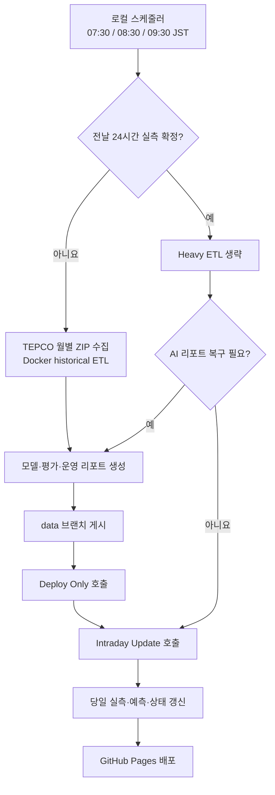

# 운영 Runbook

[English](../en/operations-runbook.md) | **한국어** | [日本語](../ja/operations-runbook.md)

이 문서는 TokyoGridEMS를 정상 운영하고 장애에서 복구하기 위한 표준 절차를 정의한다. 모델 구조와 피처 상세는 [모델 운영 명세](model-operations-spec.md)를 참고한다.

## 1. 운영 원칙

- 모든 날짜와 운영 판단은 JST(UTC+9)를 기준으로 한다.
- 전날 확정 실측과 당일 실시간 데이터는 서로 다른 수집 경로로 관리한다.
- TEPCO 예측은 비교 기준일 뿐, 모델 입력이나 보정 목표로 사용하지 않는다. 단, 아직 공개되지 않은 23시 실측의 임시 lag 입력에는 출처가 명시된 fallback을 사용할 수 있다.
- 일시적인 하루 오차만으로 모델이나 가드 임계값을 바꾸지 않는다. 데이터 결함이 아니라면 동일 레짐의 여러 날과 운영 replay를 함께 본다.
- 새 모델은 기존 Champion을 자동으로 덮어쓰지 않는다. 시간 순서 검증, 절대 품질 상한, 구간별 퇴행, 예측 drift 게이트를 모두 통과해야 한다.
- OpenAI 운영 리포트 생성 실패가 확정 실측과 예측 JSON 게시를 막아서는 안 된다. fallback 리포트는 서비스 지속용 저하 상태이며, 별도로 재생성한다.

## 2. 운영 흐름

GitHub-hosted runner에서 TEPCO 월별 ZIP이 HTTP 403을 반환할 수 있으므로, 정기 historical ETL은 로컬 Docker 배치가 담당한다. GitHub Actions의 `Manual ETL + Deploy`는 비상 수동 실행용이며 정기 스케줄은 없다.

## 3. 일일 운영 절차

### 3.1 아침 확정 ETL

로컬 작업 스케줄러는 07:30, 08:30, 09:30 JST에 실행된다.

1. `origin/data`의 최신 공개 데이터를 로컬 `web/public`으로 복원한다.
2. 전날 actual JSON에 fallback이 아닌 24개 실측 시간이 있는지 확인한다.
3. 미확정이면 TEPCO 월별 ZIP을 다시 받아 historical ETL을 실행한다.
4. 전날 운영 리포트를 생성하고 `data` 브랜치에 게시한다.
5. `Deploy Only` 후 `Intraday Update`를 호출해 당일 차트도 최신화한다.

첫 실행에서 전날 데이터가 확정되면 이후 실행은 heavy ETL을 생략한다. 운영 리포트가 저하 상태이면 리포트만 재시도하고, 이미 정상이라면 intraday 갱신만 호출한다.

### 3.2 당일 Intraday 갱신

정기 Intraday 스케줄은 다음 목적을 가진다.

- 00:10 JST: 날짜 전환
- 01:20, 03:20, 05:20 JST: 새벽 갱신
- 06:20 JST와 로컬 ETL 07:30, 08:30, 09:30 JST: 오전 ramp 구간 보강
- 10:20부터 21:20 JST: 약 2시간 단위 갱신
- 12:05 JST: 11:20 실행 지연·누락 보완
- 23:50 JST: 늦은 22시 실측 재수집

GitHub 예약 실행은 지연되거나 누락될 수 있다. 한 번의 누락만으로 모델 장애로 판단하지 말고 다음 실행, workflow 상태, 공개 JSON의 `generatedAt`을 함께 확인한다.

### 3.3 하루 종료 전 확인

- 오늘 actual의 최신 관측 시간이 합리적인지 확인한다.
- fallback 값은 `actualSource`로 실제 관측과 구분되어야 한다.
- 23시 실측이 비어 있어도 파이프라인은 중단하지 않는다. 다음 날 historical ETL에서 확정 실측으로 교체되어야 한다.
- 예측선이 비정상적으로 변했다면 `forecast_snapshots`와 operational calibration snapshot을 보존한다.

## 4. 매일 확인할 산출물

| 산출물 | 확인 내용 | 정상 기준 |
|---|---|---|
| `status.json` | 공개 데이터 범위와 생성 상태 | `availability: ok`, 날짜 범위 최신 |
| `actual/YYYY-MM-DD.json` | 전날 확정 실측 | 24시간, fallback 제외 |
| `forecast/YYYY-MM-DD.json` | 오늘·내일 예측 | 각각 24시간 |
| `reports/ai/daily/YYYY-MM-DD.json` | 전날 운영 해설 | `provider: openai` 권장, 실패 시 재생성 |
| `ops/local_etl_status.json` | 로컬 배치 최종 상태 | publish, deploy, intraday 단계 확인 |
| `metrics/model_promotion.json` | Champion/Challenger 결과 | 아래 상태표에 따라 판단 |
| `metrics/model_shadow_evaluation.json` | 복구 후보 실운영 근거 | 승인 전에 `passed: true`, 72시간 이상, 확정 2일 이상 |
| `metrics/operational_replay.json` | 최근 운영 성능 | 기간, 구간별 오차, 밴드 coverage 확인 |
| `metrics/forecast_vintage_accuracy.json` | 공정한 TEPCO 벤치마크 | 28/84일 창이 찰 때까지 `collecting`; 이를 합격으로 해석하지 않음 |

## 5. 주간 모델 운영

기본 Challenger 평가는 월요일 ETL에 실행된다. `validation_window_days: 28`은 28일마다 교체한다는 뜻이 아니라, 매 평가 시점에 최근 확정 28일을 다시 사용하는 rolling window다.

성능 저하 Champion의 복구 승격은 [모델 승격 및 성능 저하 Champion 정책](model-promotion-policy.md)을 따른다. temporal recovery gate, 보조 기간, drift, shadow 근거, 명시적 승인이 모두 있어야 하는 fail-closed 경로다.

### 5.1 승격 상태

| `status` | 의미 | 운영 조치 |
|---|---|---|
| `promoted` | 모든 검증과 drift 게이트 통과 | 새 Champion의 오늘·내일 곡선과 metadata 확인 |
| `recovery_promoted` | 승인된 성능 저하 Champion 복구 완료 | rollback artifact와 안정화 지표를 즉시 확인 |
| `recovery_candidate_ready` | replay와 필수 shadow 근거 통과, 수동 승인만 남음 | 운영자가 복구를 명시적으로 승인할 때까지 Champion 유지 |
| `recovery_approval_rejected` | 누락·오래됨·불충분한 shadow 근거에 승인을 요청함 | Champion 유지, 근거 계약을 복구하고 우회 금지 |
| `shadow_required` | drift가 크거나 복구 shadow 근거가 누락·불충분 | 승격 금지, 보존된 shadow artifact와 근거 실패 항목 확인 |
| `rejected` | 품질 또는 drift 게이트 실패 | 기존 Champion 유지, 실패 항목을 실험 후보로 기록 |
| `champion_retained` | 평가 요일이 아니거나 재학습 불필요 | 정상 상태, 수동 재학습 금지 |
| `gate_error` | 평가 실행 자체가 실패 | 기존 Champion 사용 여부 확인 후 로그와 입력 데이터 복구 |

### 5.2 승격 판단 기준

현재 게이트는 다음을 함께 본다.

- 최근 28개 확정일의 시간 순서 검증
- baseline 대비 MAE 개선
- 전체 MAE, WAPE, shape delta MAE, 최대 오차의 절대 상한
- 오전, 낮, 저녁, 영업일·비영업일 등 구간별 퇴행
- Champion 대비 오늘·내일 예측의 평균·최대 drift

TEPCO는 학습·보정 target으로 사용하지 않는다. `forecast_accuracy.json`은 최신값 참고치이며, 완성된 `forecast_vintage_accuracy.json`만 parity 자격 근거로 사용할 수 있다.

### 5.3 강제 재학습

다음 경우에만 `TOKYO_GRID_EMS_FORCE_MODEL_TRAIN=1`을 사용한다.

- 학습 피처 또는 모델 구조가 변경됨
- Champion artifact가 손상되었거나 존재하지 않음
- 정기 승격 로직 자체를 검증하는 통제된 실험

단순히 오늘 오차가 컸다는 이유로 강제 재학습하지 않는다.

## 6. 운영 Replay 판독

`metrics/operational_replay.json`은 실제로 게시된 served forecast를 최근 확정일 기준으로 재평가한다.

- `served`: 우리 모델의 MAE, WAPE, RMSE, shape 오차
- `reference.tepco`: 동일 시간대 TEPCO 비교값
- `interval`: 예측 밴드 coverage와 폭
- `stages`: snapshot이 있는 날짜의 raw 및 후처리 단계별 성능
- `analogShadow`: Analogous Day를 적용했을 때의 shadow 성능
- `coverage`: 평가 시간과 stage snapshot 누락일

`missingStageSnapshotDates`는 일일 실측 성능이 누락됐다는 뜻이 아니다. 해당 날짜의 단계별 원인 분석이 제한된다는 뜻이다.

## 7. 변경 판단 규칙

| 상황 | 즉시 수정 | 관측 후 수정 |
|---|---|---|
| JSON 누락, 잘못된 actual source, 날짜 경계 오류 | 예 | |
| 배포 실패, 스케줄 오류, 인증 실패 | 예 | |
| 동일 시간대의 비정상 spike가 재현되고 원인이 코드로 확정됨 | 예, 회귀 테스트 포함 | |
| 하루 MAE 악화 또는 TEPCO보다 낮은 성능 | | 최소 3개 유사일과 replay 확인 |
| 새 피처·가드·threshold 제안 | | 시간 순서 백테스트와 구간별 퇴행 확인 |
| 밴드가 한 번 이탈하거나 넓어짐 | | coverage와 폭을 여러 확정일로 평가 |

모델 변경은 원인 가설, 반증 조건, 영향 구간, rollback 기준을 문서에 남긴다. 같은 날 실측을 보고 해당 시간 예측을 맞추는 사후 보정은 모델 개선으로 간주하지 않는다.

## 8. 장애 대응

| 증상 | 우선 확인 | 조치 |
|---|---|---|
| TEPCO historical fetch 403 | 로컬 fetch 로그, URL 접근 | GitHub runner 우회 대신 로컬 Docker ETL 재실행 |
| 전날 actual 24시간 미확정 | `.etl_state.json`, actual source | 다음 아침 실행까지 재시도, 임의 확정 금지 |
| Intraday workflow 실패 | GitHub Actions 상태, data push 충돌 | 일시적 GitHub 장애면 다음 스케줄 대기, 지속 시 수동 dispatch |
| AI 리포트 실패 | provider, HTTP 상태, 프로젝트 전용 키 | 예측 데이터는 먼저 게시하고 리포트만 재생성 |
| `gate_error` | 학습량, config, artifact 호환성 | 기존 Champion 유지 확인 후 원인 복구 |
| Pages가 오래된 데이터 표시 | `data` 브랜치 최신 커밋, Deploy Only | data 게시 성공 후 Deploy Only 재실행 |
| 밴드가 지나치게 좁거나 넓음 | interval coverage와 tail 진단 | 하루 모양만 고치지 말고 calibration shadow 평가 |

## 9. 복구와 롤백

1. 오류가 데이터 수집인지, 모델 학습인지, 후처리인지, 배포인지 먼저 분리한다.
2. 마지막 정상 `data` 브랜치 커밋과 현재 커밋을 비교한다.
3. 모델 문제라면 마지막 정상 `.lgbm_model.pkl`과 `.lgbm_model_meta.json`을 Git 이력에서 복원한다.
4. public JSON을 수동 편집하지 말고 동일 입력으로 ETL을 재실행한다.
5. 검증 게이트와 public artifact 검사를 통과한 뒤 다시 게시한다.
6. 장애 원인과 재발 방지 테스트를 문서화한다.

## 10. 공개 정보와 비공개 정보

이 Runbook과 모델 승격 기준, 스케줄, 장애 대응 원칙은 재현성과 신뢰성을 위해 공개한다.

다음 정보는 저장소에 커밋하지 않는다.

- API 키, GitHub token, credential
- 개인 PC 사용자명과 절대 경로
- Windows 작업 스케줄러 실행 계정
- 로컬 `.env` 내용과 인증 로그

개인 환경의 실제 등록·삭제 명령과 로그 위치는 별도의 비공개 로컬 운영 메모에서 관리한다.
